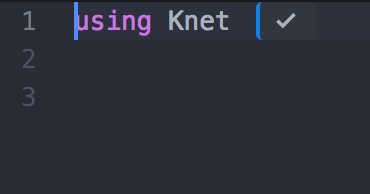
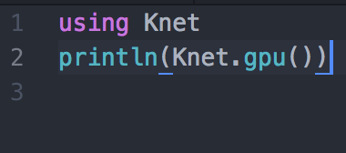

# Juno

## Installation

This guide assumes that you have Julia installed both on your local computer and
remote server.

### Install Atom

#### Mac OS
* Atom follows standard Mac zip installation process.
* Go to Atom's [website](https://atom.io) and press the *Download* button.
* Once you have that file, you can click on it to extract the application and then drag the new Atom application into your *Applications* folder.
* Run ```$which atom``` to see if the installation is successful.

#### Linux
```bash
$curl -L https://packagecloud.io/AtomEditor/atom/gpgkey | sudo apt-key add -
$sudo sh -c 'echo "deb [arch=amd64] https://packagecloud.io/AtomEditor/atom/any/ $any main" > /etc/apt/sources.list.d/atom.list'
$sudo apt-get update
```
You can now install Atom using ```apt-get```
```bash
$sudo apt-get install atom
$sudo apt-get install atom-beta
```

### Install Juno
* Open Atom
* Open settings (Ctrl/Cmd + ,) and go to the "Install" panel.
* Type ```uber-juno``` into the search box and hit enter.
* Install the ```uber-juno``` package.

Your Atom is now a Julia IDE.

### Using with SSH
* Note that for this to run you have to stop the Julia console that is handled by Juno.
* Open Julia console in Atom by hitting ```Ctrl/Cmd + O``` and terminate the console (if running) by hitting ```Ctrl + D```
* Hit ```Ctrl/Cmd+Shift+P``` in Atom.
* Search for ```Julia Client: Connect External Process``` and click on it.
* A pop up that shows you the port will appear


Here ```51838``` is the port that Juno is listening to.  

* You need to determine a port that is not being used. I've picked ```8008```.
* While Atom is open, log in with SSH to your instance like the following in a separate Terminal window.

```bash
ssh -R 8008:localhost:51838 ec2-user@<my_public_dns> -i /path/my-key-pair.pem
```  

```julia
ec2-user@<my_public_dns>$ julia
julia> Pkg.add("Atom")
julia> Pkg.add("Juno")
```
* After the installations are done run the following

```julia
julia> using Juno; Juno.connect(8008)
```  

* After a few seconds, you will receive a notification from Atom indicating the
connection is successful


* Now every code you execute at your computer will be executed on the remote server.

#### Running your Code

* Hit ```Shift+Enter``` to run a block of code


* Hit ```Shift+Ctrl/Cmd+Enter``` to run the entire code. The outputs will be
printed to the terminal window where you established the connection.



#### Workspace

You can also see the Workspace (variables) in your local computer via Atom even
though the environment is located at the remote server.
* You can toggle Workspace by clicking on the Workspace button on the left-hand
side Juno toolbar
* If the toolbar is not there: go to Packages->Julia->Settings and check the
```Enable Menu``` and ```Enable Tool Bar``` checkboxes.


### Running Remote Terminal and Atom in the Same Window
This is a hack to run remote Julia server in Atom to see the console outputs
without navigating between windows.
* Open settings (Ctrl/Cmd + ,) and go to the "Install" panel.
* Type ```terminal``` in the search box and install ```platformio-ide-terminal```
* Restart Atom
* Tools to open or close terminal windows in Atom are added at the bottom left in Atom.
* Hit ```+``` open a new terminal window, ```X``` to close all windows.
* Open a new terminal window and use this instead of a seperate terminal window for SSH connection and repeat the steps above.


#### Acknowledgment
---
This document is mostly prepared by [Cem](https://github.com/ceteke), thanks for his genuine helps.
